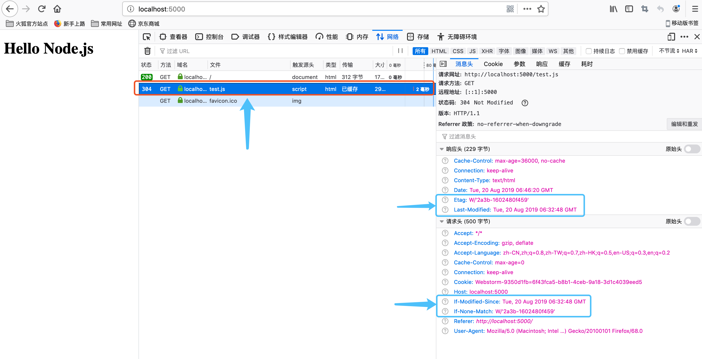
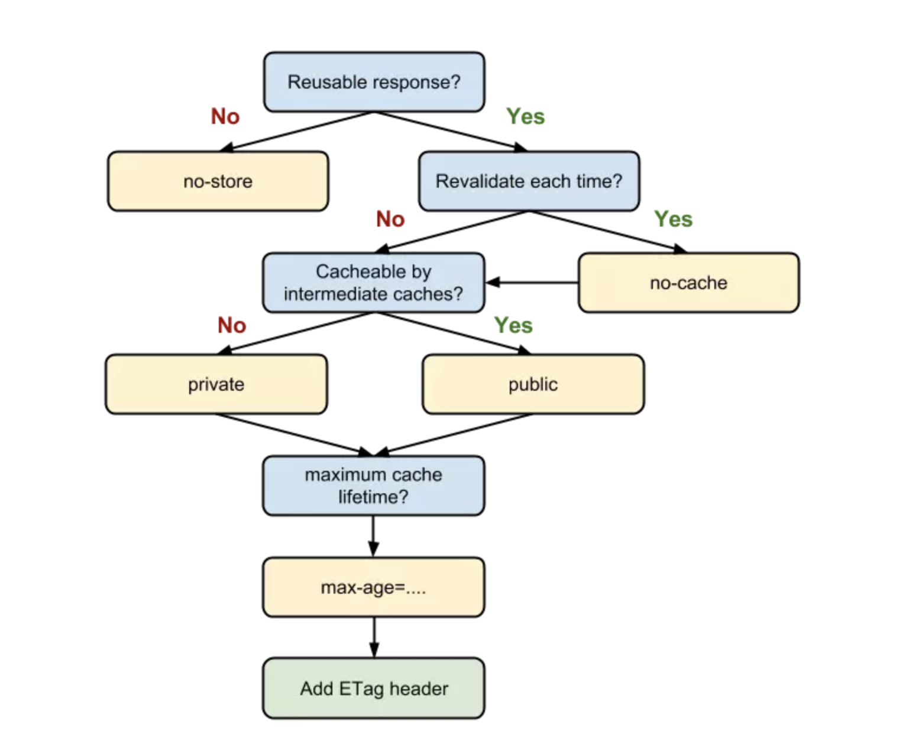

## 学习背景
刚做前端时，我面试时被问到：从浏览器输入一个 URL 会发生什么？

现在来回答这个问题，我以现在的水平回答也觉得很难，我上网翻阅了非常多关于此问题的资料，我惊叹着这个知识系统如此庞大，我发现了顺着这个知识脉络，可以把前端的知识点也能够系统学习，比如开始进行 dns解析得到IP，dns解析那么慢如何优化？设置缓存，设置dns prefetch，得到了IP后进行TCP连接，TCP连接每次都需要进行三次握手的耗时，如何优化？设置长连接，预连接，接入 SPDY 协议，TCP连接完成后进行HTTP请求，HTTP请求这块前端可以减少一些HTTP请求或请求体积，后端设置强缓存，协商缓存优化等，后端处理完后HTTP响应发回请求数据，前端工程师这里才是真正的发挥实力，比如涉及资源加载优化、服务端渲染、浏览器缓存机制的利用、DOM 树的构建、网页排版和渲染过程、回流与重绘的考量、DOM 操作的合理规避等等，这也涉及到了HTML，CSS，和JavaScript的一些底层渲染机制

## 学习大纲
- 网络层面优化
- 浏览器渲染优化

## DNS prefetch

向浏览器输入一个 URL 后，首先通过 DNS（域名解析系统）将 URL 解析为对应的 IP 地址，解析之前会查询缓存，查询缓存的顺序为：
浏览器缓存 ——> hosts系统缓存 ——> 路由器缓存 ——> ISP（互联网服务提供商）DNS缓存，如果没有缓存就继续查询 ——> 根域名服务器 ——> 顶级域名服务器 ——> 主域名服务器 ——> 保存结果至缓存。

DNS解析是一个漫长的过程，可以使用 **DNS 缓存** 和 **DNS prefetch**（DNS预解析）来优化。DNS prefetch 的原理：开启了DNS prefetch后，浏览器在空闲时间会提前把这些域名转换为对应的 IP 地址，缓存到系统缓存中，从而缩短 DNS 解析花费的时间，提高访问网站的速度，以下是设置 DNS prefetch的方式：

```html
<!doctype html>
<html lang="en">
<head>
    <meta charset="UTF-8">
    <title>DNS prefetch</title>
    <!-- 开启DNS预解析 -->
    <meta http-equiv="x-dns-prefetch-control" content="on">
    <link rel="dns-prefetch" href="//cdn.boblog.com">
    <link rel="dns-prefetch" href="//images.boblog.com">
</head>
<body>
</body>
</html>
```

## TCP连接三次握手

拿到了IP后，需要利用ip地址和服务器建立tcp连接，TCP/IP需要进行三次握手连接和四次挥手断开连接。

三次握手的目的是为了确保数据能到达目标：

```
客户端：首先发送一个SYN标志的数据给服务端
服务端：接接收到后，回传给客户端一个SYN/ACK的数据包表示传达确认信息
客户端：接收到后，再回传带有一个ACK标志的数据包，代表握手结束。
```

优化点：TCP三次握手很慢，解决方案：
1. 长连接
2. 预连接
3. 接入 SPDY 协议


TCP/IP建立连接后，就发起一个HTTP请求，正式的传输数据了，从客户端发出http请求到服务器接收，中间会经过一系列的流程：比如五层因特网协议栈，这个流程就是：

> 从应用层发送HTTP请求，到传输层通过三次握手建立TCP/IP连接，再到网络层的IP寻地址，再到数据链路层的封装成帧，最后到物理层的利用物理介质传输数据。

五层因特网协议栈其实就是：
1. 应用层(dns,http) DNS解析成IP并发送http请求
2. 传输层(tcp,udp) 建立tcp连接（三次握手）
3. 网络层(IP,ARP) IP寻址
4. 数据链路层(PPP) 封装成帧
5. 物理层(利用物理介质传输比特流) 物理传输（然后传输的时候通过双绞线，电磁波等各种介质）

一个完整的OSI七层框架，与之相比，多了会话层、表示层：
6. 表示层：主要处理两个通信系统中交换信息的表示方式，包括数据格式交换，数据加密与解密，数据压缩与终端类型转换等
7. 会话层：它具体管理不同用户和进程之间的对话，如控制登陆和注销过程

从服务器接收到请求到对应后台接收到请求，后台会做一些处理，比如参数拦截验证，跨域验证，如果不符合要求则返回一些HTTP报文的信息和状态码，如果符合就按照预期返回数据。

负载均衡：对于大型的项目，由于并发访问量很大，所以往往一台服务器是吃不消的，所以一般会有若干台服务器组成一个集群，然后配合反向代理实现负载均衡，用户发起的请求都指向调度服务器（反向代理服务器，譬如安装了nginx控制负载均衡），然后调度服务器根据实际的调度算法，分配不同的请求给对应集群中的服务器执行，然后调度器等待实际服务器的HTTP响应，并将它反馈给用户。

前后端交互时，http报文作为信息的载体。http报文分为请求报文和响应报文。

请求报文包含：请求方法，请求URI，协议版本，可选的请求首部字段和内容实体构成的。HTTP的特点是：无状态，无连接，简单快速，灵活。

请求方法


方法 | 说明
---|---
GET | 获取资源 
POST | 传输实体主体
PUT | 传输文件
HEAD | 获得报文首部
DELETE | 删除文件
OPTIONS | 询问支持的方法
TRACE | 追踪路径
CONNECT | 要求用随到协议连接代理
LINK | 建立和资源之间的联系
UNLINK | 断开连接关系

GET和POST的区别：
- GET在浏览器回退时是无害的，而POST会再次提交
- GET产生的URL地址被收藏，而POST不可以
- GET请求会被浏览器主动缓存，而POST不会，除非手动设置
- GET请求参数会被完整保留在浏览器历史记录里，而POST中的参数不会被保留
- GET请求在URL中传送的参数是有长度限制的，而POST没有限制
- 对参数的数据类型，GET只接受ASCII字符，而POST没有限制
- GET比POST更不安全，因为参数直接暴露在URL上，所以不能传递敏感信息
- GET参数通过URL传递，POST放在Request body中

## 持久连接
每次HTTP通信就要断开一次TCP连接，为了解决这个问题使用持久连接来解决这个问题，也称为 HTTP keep-alive，HTTP/1.1支持。

持久连接的特点就是只要任意一端没有明确提出断开连接，则保持TCP连接状态。

持久连接的好处在于减少了TCP连接的重复建立和断开所造成的额外开销，减轻了服务器端的负载。

## 管线化
持久连接使得多数请求延伸了管线化，简单来说，之前发生一个请求需要等待响应，才能发生下一个请求，管线化技术出现后，不用等待响应亦可以直接发生下一个请求，且支持并行多发送多个请求，不用等待一个接一个地等待响应了。

## HTTP报文
HTTP报文分为请求报文和响应报文，请求报文包含请求行，请求头，空行，请求体，响应报文包含状态行，响应头，空行，响应体。


## HTTP状态码

状态码类别


状态码 | 类别 | 说明
---|---|---
1XX | 信息性状态码 | 接收的请求正在处理
2XX | 成功的状态码 | 请求正常处理完毕
3XX | 重定向状态码 | 需要进行附加操作以完成请求
4XX | 客户端错误状态码 | 服务器无法处理请求
5XX | 服务器错误状态码 | 服务器处理请求出错

- 200 表示客户端发来的请求在服务器上被正常处理了。
- 204 代表服务器接收的请求已经成功被处理，但客户端不需要更新其现有页面。
- 301 永久重定向，分配了新的URL
- 302 临时重定向，分配了新的URL
- 304 协商缓存

应用层HTTP解析请求头和请求体，如果需要重定向，HTTP直接返回HTTP响应数据的状态code301或者302，同时在请求头的Location字段中附上重定向地址，浏览器会根据Location进行重定向操作；如果不是重定向，首先服务器会根据 请求头中的If-None-Match 的值来判断请求的资源是否被更新，如果没有更新，就返回304状态码，协商缓存，相当于告诉浏览器之前的缓存还可以使用，就不返回新数据了；否则，返回新数据，200的状态码，并且如果想要浏览器缓存数据的话，就在相应头中加入字段：Cache-Control:Max-age=？，响应数据返回到网络进程。

## 强缓存
强缓存使用 expires 和 Cache-Control 头信息设置。
### expires
1. 作用：服务器响应后，向头部设置 expires 过期的时间，如果再次请求资源，浏览器会拿本地时间和 expires 时间戳对比，如果未过期，直接使用缓存数据。
2. 缺点：依赖本地时间，且本地时间容易被修改则不符合预期效果

```js
const http = require('http')

http.createServer((req, res) => {
    res.writeHead(200, {
        'Content-Type': 'text/plain',
        // 设置 Expires
        'Expires': 'Tue, 20 Aug 2019 10:30:49 GMT'
    })
    res.end('Hello Node.js')

}).listen(5000)
```

### Cache-Control 
- 出现的背景：修复 expires 的缺点，expires 能做的事情，Cache-Control 都能做；expires 完成不了的事情，Cache-Control 也能做。因此，Cache-Control 可以视作是 Expires 的完全替代方案。在当下的前端实践里，我们继续使用 Expires 的唯一目的就是向下兼容。
- 优点：Cache-Control 相对于 expires 更加准确，它的优先级也更高。
- Cache-Control 字段属性:
    - max-age = [秒] 响应的最大 Age 值
    - s-maxage = [秒] 公共缓存服务器响应的最大 Age 值
        - s-maxage 优先级高于 max-age
        - s-maxage 仅在代理服务器中生效，客户端中我们只考虑max-age 
    - public 可向任意方提供响应的缓存
    - private 仅向特定用户返回响应
        - 如果我们为资源设置了 public，那么它既可以被浏览器缓存，也可以被代理服务器缓存
        - 如果我们设置了 private，则该资源只能被浏览器缓存
        - private 为默认值
    - no-store 不缓存请求或响应的任何内容
    - no-cache 缓存前必须先确认其有效性（协商缓存）

```js
const http = require('http')

http.createServer((req, res) => {
    res.writeHead(200, {
        'Content-Type': 'text/plain',
        'Cache-Control': 'max-age=3600, s-maxage=36000'
    })
    res.end('Hello Node.js')

}).listen(5000);
```

## 协商缓存
协商缓存：浏览器与服务器合作之下的缓存策略，协商缓存的机制下，浏览器会向服务器询问相关缓存信息，判断重新发起新请求获取数据，还是从本地获取缓存的资源。如果服务端提示缓存资源未改动（Not Modified），资源会被重定向到浏览器缓存，这种情况下网络请求对应的状态码是 304。

协商缓存的实现：

### Last-Modified 与 If-Modified-Since
 Last-Modified 服务端返回的指明资源最终修改的时间。每次发起请求时候会带上 If-Modified-Since 字段，其值是 Last-Modified 的值，服务器收到后，会进行对比最后修改的时间是否一致，如果发生了变化，则重新响应回来一个新内容，且重新带回来一个 Last-Modified 新时间戳值，如果没有发生改变，则返回 304 状态码。

缺点：
- 我们编辑了文件，但文件的内容没有改变。服务端并不清楚我们是否真正改变了文件，它仍然通过最后编辑时间进行判断。因此这个资源在再次被请求时，会被当做新资源，进而引发一次完整的响应——不该重新请求的时候，也会重新请求。
- 当我们修改文件的速度过快时（比如花了 100ms 完成了改动），由于 If-Modified-Since 只能检查到以秒为最小计量单位的时间差，所以它是感知不到这个改动的——该重新请求的时候，反而没有重新请求了。

### Etag 与 If-None-Match
Etag 是由服务器为每个资源生成的唯一的标识字符串，这个标识字符串是基于文件内容编码的，只要文件内容不同，它们对应的 Etag 就是不同的，反之亦然。因此 Etag 能够精准地感知文件的变化。
```
ETag: W/"2a3b-1602480f459"
```

那么下一次请求时，请求头里就会带上一个值相同的、名为 if-None-Match 的字符串供服务端比对了：

```
If-None-Match: W/"2a3b-1602480f459"
```

- ETag的优点：Etag 在感知文件变化上比 Last-Modified 更加准确，优先级也更高。当 Etag 和 Last-Modified 同时存在时，以 Etag 为准。
- ETag的缺点：Etag 的生成过程需要服务器额外付出开销，会影响服务端的性能。

## Node.js模拟实现
```js
const http = require("http")
const fs = require('fs')

const LAST_MODIFIED_TIME = 'Tue, 20 Aug 2019 06:32:48 GMT'
const ETAG_NAME = " W/\'2a3b-1602480f459\'"

http.createServer((req, res) => {
    if (req.url === '/') {
        const html = fs.readFileSync('./index.html', 'utf8')
        res.writeHead(200, {
            'Content-Type': 'text/html'
        })
        res.end(html)
    }

    if (req.url === '/test.js') {
        // 获取 if-none-match 和 if-modified-since
        const IF_MODIFIED_SINCE = req.headers["if-modified-since"];
        const IF_NONE_MATCH = req.headers["if-none-match"];

        // 判断头信息是否一致
        if (IF_MODIFIED_SINCE === LAST_MODIFIED_TIME || IF_NONE_MATCH === ETAG_NAME) {
            res.writeHead(304, {
                'Content-Type': 'text/html',
                'Cache-Control': 'max-age=36000, no-cache',
                'Last-Modified': LAST_MODIFIED_TIME,
                'Etag': ETAG_NAME
            })
            res.end('')
        } else {
            res.writeHead(200, {
                'Content-Type': 'text/html',
                'Cache-Control': 'max-age=36000, no-cache',
                'Last-Modified': LAST_MODIFIED_TIME,
                'Etag': ETAG_NAME
            })
            res.end(`console.log('Hello, Node.js')`)
        }
    }
}).listen(5000)
```

## 测试结果


## 总结


当我们的资源内容不可复用时，直接为 Cache-Control 设置 no-store，拒绝一切形式的缓存；否则考虑是否每次都需要向服务器进行缓存有效确认，如果需要，那么设 Cache-Control 的值为 no-cache；否则考虑该资源是否可以被代理服务器缓存，根据其结果决定是设置为 private 还是 public；然后考虑该资源的过期时间，设置对应的 max-age 和 s-maxage 值；最后，配置协商缓存需要用到的 Etag、Last-Modified 等参数。

